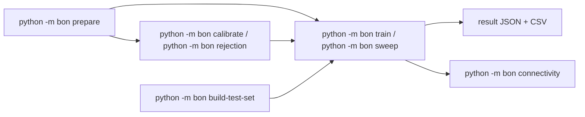

# Learning Reward Models from Best-of-N Preference Data

Real-world experiments for the paper. Every experiment runs through `python -m bon <command>` from `publish_code/`.

Three things you might want to do with this code:

1. **Phase 1 — generate training + test data** for an experiment.
2. **Phase 2 — train** a linear reward head on the result and evaluate it on a held-out test set.
3. **Phase 3 — measure connectivity** between a `(train, test)` pair.

Each phase is one command; everything else is a lower-level building block you can skip unless you want checkpointing.

> The synthetic-data experiments from the paper are **not** included here.

---

## 0. What you need

- A Linux box with at least one CUDA GPU. Generation/scoring want ≥ 24 GB VRAM (bf16 Llama-3.1-8B). Linear-head training is light and fits on any GPU.
- Python 3.9+.
- A Hugging Face account with access to the gated models (defaults):
  - `meta-llama/Meta-Llama-3.1-8B-Instruct` (base model / generator)
  - `Skywork/Skywork-Reward-V2-Llama-3.1-8B` (reward model)
- Disk: a full sweep grows to ~50 GB (responses + scores + embedding caches). The smoke test stays under 1 GB.

## 1. Install

All commands below assume you are inside `publish_code/` so that `python -m bon` can find the package.

```bash
cd publish_code
python -m venv .venv && source .venv/bin/activate
pip install -r requirements.txt

huggingface-cli login   # for the gated models
```

Verify with `python -m bon --help`.

## 2. Five-minute smoke test

```bash
python -m bon demo
```

Runs the whole pipeline end-to-end on a tiny pinned config (`seed=0, N=2, train_size=32, num_chunks=1`, UltraFeedback, 64 test pairs) isolated under `data/demo/`. The final output prints three accuracy lines:

```
Test accuracy:            73.438
Hard pairs accuracy:      47.368
Very hard pairs accuracy: 28.571
```


Useful flags: `--dry-run` (print the 5 commands, no side effects), `--clean` (wipe `data/demo/` first), `--skip-existing` (resume after a failure).

## 3. The big picture

### 3a. Dataset identity

Every artifact this pipeline produces is keyed by a small set of knobs. Getting them consistent across commands matters more than any individual flag — mismatched values silently build a different dataset at a slightly different path.

- **Training dataset**: `(name, seed, N, train_size, base_model, reward_model)`.
  - A **rejection-sampling dataset** adds `(c, w, p)`.
- **Test set**: `(source_dataset, reward_model)`. GSM8K also depends on `base_model` (its pairs come from model-sampled responses).
- **Calibration** (used only for distribution reshaping): `(name, seed, base_model, reward_model)` — reusable across every `(c, w, p)` sweep with the same tuple.

Per knob:

| Knob            | Meaning                                                                                      |
| --------------- | -------------------------------------------------------------------------------------------- |
| `--name`        | Experiment tag reused across `plan/generate/score/calibrate/rejection/train/sweep/connectivity`. Pick it once. |
| `--seed`        | Sampling seed. Re-running with the same seed reproduces the same prompt/response slice.      |
| `--N`           | Best-of-N triplet size (paper's *N*). Replaces the older `--k`.                              |
| `--train-size`  | Training-set size (number of prompts sampled per config). Replaces the older `--n`.          |
| `--base-model`  | Generator / backbone HF id. Default `meta-llama/Meta-Llama-3.1-8B-Instruct`.                 |
| `--reward-model`| Reward-model HF id used for scoring / calibration. Default `Skywork/Skywork-Reward-V2-Llama-3.1-8B`. |
| `--c`, `--w`, `--p` | Reshaping parameters. See §1c.                                                           |

> On the CLI the paper's *N* and the training-set size are called `--N` and `--train-size`. On-disk filenames still use the older `n_/k_` spelling (e.g. `pairs_n{train_size}_k{N}_seed{seed}.pt`) for backward compatibility with pre-generated artifacts.

### 3b. Phase flow



---

# Phase 1 — generate data

You need two things: **training pairs** (prompts with chosen/rejected responses) and a **test set** (binarized pairs from the source dataset).

### 1a. Training pairs

One command for the happy path:

```bash
python -m bon prepare \
  --source-dataset ultrafeedback \
  --name ultrafeedback-base \
  --base-model  meta-llama/Meta-Llama-3.1-8B-Instruct \
  --reward-model Skywork/Skywork-Reward-V2-Llama-3.1-8B \
  --seeds 0 1 2 \
  --N 2 4 8 16 \
  --train-size 32 128 512 2048 8192 \
  --num-chunks 8 \
  --gpus 0 1 2 3 4 5 6 7
```

> **Models matter.** `python -m bon prepare` is keyed by both `--base-model` (generator) and `--reward-model` (scorer); changing either writes to a different path under `data/llm_responses/<name>/.../model_<base>/scores/model_<reward>_chunk_*.gz`. Default values reproduce the paper.

`python -m bon prepare` is a thin bundle around three lower-level commands. You can run them individually if you want to checkpoint between stages, split work across machines, or tweak flags that `prepare` doesn't expose:

For finer control, each stage (`plan`, `generate`, `score`) is also a subcommand; use `python -m bon prepare --stop-after {plan,generate,score}` to checkpoint, or `python -m bon <subcommand> --help` for the full flag list.

### 1b. Test set

Separate from training data because it's shared across experiments for the same source dataset:

```bash
# UltraFeedback / PKU-SafeRLHF: reward model only.
python -m bon build-test-set --source-dataset ultrafeedback \
                   --reward-model Skywork/Skywork-Reward-V2-Llama-3.1-8B
python -m bon build-test-set --source-dataset pku-saferlhf  \
                   --reward-model Skywork/Skywork-Reward-V2-Llama-3.1-8B

# GSM8K: needs a pre-generated response pool, so both base and reward model apply.
# (Generate the response pool first with `python -m bon generate --name gsm8k_test_set ...`.)
python -m bon build-test-set --source-dataset gsm8k \
                   --base-model   meta-llama/Meta-Llama-3.1-8B-Instruct \
                   --reward-model Skywork/Skywork-Reward-V2-Llama-3.1-8B
```

> **Models matter.** The test set is reward-model-dependent (and, for GSM8K, base-model-dependent). Switch either model -> rebuild. The output file `data/test_set/<stem>_test.gz` itself is not model-tagged, so pick `--test-name` deliberately when running multiple reward models.

Each call scores the binary-preference split with the reward model and writes to `data/test_set/<stem>_test.gz`. The default stems (used below) are:

| `--source-dataset` | Default `--test-name` stem        | Notes |
| ------------------ | ---------------------------------- | ----- |
| `ultrafeedback`    | `ultrafeedback`                    | `HuggingFaceH4/ultrafeedback_binarized` test_prefs split. |
| `pku-saferlhf`     | `pku_saferlhf`                     | PKU-SafeRLHF test split, filtered to unambiguous `safer_response_id`. |
| `gsm8k`            | `gsm8k_medium_difficulty_final`    | Chosen is a *correct* GSM8K response whose reward outscores the best *incorrect* response by ≥ +2 (see `_create_preference_pair_gsm8k` in [`bon/test_set.py`](bon/test_set.py)). This is the one GSM8K test set used in the paper. |

### 1c. (Optional) Distribution reshaping

Pass `--reshape` to `python -m bon prepare` and it also runs the calibrate → rejection steps to build a reshaped Best-of-N dataset. This is the setup from the paper's distribution-reshaping experiments.

```bash
python -m bon prepare \
  --source-dataset ultrafeedback \
  --name ultrafeedback-pminus \
  --base-model  meta-llama/Meta-Llama-3.1-8B-Instruct \
  --reward-model Skywork/Skywork-Reward-V2-Llama-3.1-8B \
  --seeds 0 1 2 --N 1 --train-size 512 \
  --num-chunks 8 --gpus 0 1 2 3 \
  --reshape \
  --c 0.15 0.3 0.5 0.7 0.85 \
  --w 0.1 0.2 0.3 \
  --p 0.8 \
  --N-reshape 4
```

> **What `c`, `w`, `p` mean** (see [`bon/rejection.py`](bon/rejection.py)).
> For each prompt the reward model gives every generated response a score; calibration turns that into an empirical percentile in `[0, 1]`. A sample passes through the filter with probability `p`; the remaining `1 - p` of samples are kept unconditionally. The filter targets the percentile band `[|c| - w/2, |c| + w/2]`:
>
> - `c ≥ 0` → accept inside the band (**upsampling** that band).
> - `c < 0` → reject inside the band (**downsampling** that band).
> - `w` is the band *width* and is always ≥ 0.
> - `p = 0` degenerates to vanilla Best-of-N sampling.

> **Calibration is reusable.** The calibration file is keyed by `(name, base_model, reward_model)` — not by `(c, w, p)` — so the same calibration is shared across every point in your `(c, w, p)` sweep. `python -m bon rejection` auto-runs `python -m bon calibrate` if the cache is missing, so running it manually first is optional.

You can also run the two reshaping stages by hand (same semantics, more checkpointing):

The calibrate and rejection stages are also available as standalone subcommands (`python -m bon calibrate`, `python -m bon rejection`) if you want to split the work; otherwise `--reshape` wires them in automatically.

---

# Phase 2 — train

One command, one `(train_name, test_name, N, train_size, seed)` slice:

```bash
python -m bon train \
  --train-name ultrafeedback-base \
  --test-name  ultrafeedback \
  --base-model meta-llama/Meta-Llama-3.1-8B-Instruct \
  --reward-model-name skywork-v2 \
  --train-size 2048 --N 8 --seed 0
```

Under the hood `python -m bon train` (i) embeds the train and test pairs with the frozen backbone, (ii) runs a 5-fold CV sweep over `(learning_rate, weight_decay)` to pick the best config, and (iii) trains the final linear head on the full training set. Outputs go to `llm_results/`.

> **Models matter.** `--base-model` and `--reward-model-name` must match the values that produced the responses/scores under `--train-name`. For a rejection-sampling run you also pass `--generator-model` / `--reward-model-path` so the rejection dataset can be located — by default these match `--base-model` and the Skywork reward model.

To sweep across `(train_size, N, seed)` for a standard Best-of-N experiment, use `python -m bon sweep`:

```bash
python -m bon sweep \
  --train-name ultrafeedback-base \
  --test-name  ultrafeedback \
  --seeds 0 1 2 \
  --train-size 32 128 512 2048 8192 \
  --N 2 4 8 16 \
  --gpus 0 1 2 3 4 5 6 7
```

Variants:

- **Best-vs-Worst.** Re-run the sweep with `--data-type west-of-n`. No new generation needed — the same response pool is reused.
- **Distribution reshaping.** Pass `--data-type rejection_sample`, a single `--train-size` / `--N`, and the `(c, w, p)` grid:

  ```bash
  python -m bon sweep \
    --train-name ultrafeedback-pminus \
    --test-name  ultrafeedback \
    --data-type rejection_sample \
    --seeds 0 1 2 \
    --c 0.15 0.3 0.5 0.7 0.85 --w 0.1 0.2 0.3 --p 0.8 \
    --train-size 512 --N 4 \
    --gpus 0 1 2 3
  ```

- **Backbone ablations.** The experiment tag is the same across backbones — only the model flag changes. `python -m bon generate` writes the Qwen responses into a `model_<backbone>/` subdir of the existing `data/llm_responses/<name>/...` tree, and results are namespaced per backbone under `llm_results/.../backbone_<tag>/`, so nothing collides with the Llama run:

  ```bash
  python -m bon generate --name ultrafeedback-base --model Qwen/Qwen3-8B \
               --seeds 0 1 2 --num-chunks 8 \
               --parallel --gpus 0 1 2 3 4 5 6 7
  python -m bon score    --name ultrafeedback-base --base-model Qwen/Qwen3-8B \
               --seeds 0 1 2 --num-chunks 8 \
               --parallel --gpus 0 1 2 3 4 5 6 7

  python -m bon sweep    --train-name ultrafeedback-base \
               --base-model Qwen/Qwen3-8B --test-name ultrafeedback \
               --seeds 0 1 2 --train-size 32 128 512 2048 8192 --N 2 4 8 16 \
               --gpus 0 1 2 3 4 5 6 7
  ```

  > **Naming recap.** `--name` (on plan/generate/score) and `--train-name` (on train/sweep/connectivity) are the *same* experiment tag — it pins the prompt slice and the response pool on disk. The backbone that actually produces and embeds the responses is `--model` / `--base-model`. Use `--mapping-name` only when you deliberately want to re-use a plan that was written under a different `--name`.

The recipe table below maps the three reshaping experiments to the flags you need. The test set in column 3 is the default stem produced by `python -m bon build-test-set --source-dataset ...`:

| Experiment     | `--train-name`          | `--source-dataset` for the test set | Default `--test-name` |
| -------------- | ----------------------- | ----------------------------------- | --------------------- |
| UltraFeedback  | `ultrafeedback-pminus`  | `ultrafeedback`                     | `ultrafeedback`       |
| PKU-SafeRLHF   | `pku-saferlhf-pminus`   | `pku-saferlhf`                      | `pku_saferlhf`        |
| GSM8K          | `gsm8k-pminus`          | `gsm8k`                             | `gsm8k_medium_difficulty_final` |

---

# Phase 3 — connectivity

The connectivity degree between a `(train, test)` pair is the smallest generalized eigenvalue of `Σ_test` with respect to `Σ_train`, where each `Σ` is the covariance of the paired-embedding differences (see [`bon/connectivity.py`](bon/connectivity.py)). Intuitively: how well the training distribution covers directions that matter under the test distribution.

`python -m bon connectivity` reuses the cached embeddings written by `python -m bon train`, so you typically compute it right after training:

```bash
python -m bon connectivity \
  --train-name ultrafeedback-extra \
  --test-name  ultrafeedback \
  --seeds 0 1 2 --N 2 4 8 16 --train-size 131072 \
  --output-path results/connectivity_ultrafeedback.json
```

---

## 4. Where things land on disk

```
data/
  requirements/<name>_seed_<seed>.json                          # python -m bon plan
  mappings/<name>_seed_<seed>.json                              # python -m bon plan (keys use legacy k_/n_)
  llm_responses/<name>/seed_<seed>/temperature_<T>/             # python -m bon generate
      [model_<base-model>/]                                     #   (subdir only if base != default)
      responses_chunk_*_of_*.gz
      scores/model_<reward-model-name>_chunk_*_of_*.gz          # python -m bon score (keyed by reward)
      embeddings_cache/<base-model>/*.pt                        # python -m bon train (keyed by base)
  calibrations/<name>/model_<base>_reward_<reward>/             # python -m bon calibrate (keyed by BOTH)
      calibration_file.gzip
  test_set/<test-name>_test.gz                                  # python -m bon build-test-set (reward-dependent)
llm_results/
  sweep_configs/...                                             # best CV hyperparameters per run
  dataset_<train-name>/test_dataset_<test-name>/backbone_<base>/
      n<train_size>_k<N>_seed<s>.json                           # note the legacy n_/k_ spelling
      └─ contains test_accuracy, hard_accuracy, very_hard_accuracy, best_cfg
logs/                                                           # per-job logs when --parallel is used
```

After `python -m bon sweep` finishes for a `--data-type standard` run it also writes `aggregated_final_accuracy_results_<train-name>.csv` alongside the individual JSONs — one row per `(n, k, seed)` (legacy column names, sourced from `train_size` / `N`).

Each result JSON looks like:

```json
{
  "args": { "train_size": 2048, "N": 8, "seed": 0, "base_model": "...", "...": "..." },
  "test_accuracy": 0.712,
  "hard_accuracy": 0.604,
  "very_hard_accuracy": 0.551,
  "best_cfg": { "learning_rate": 0.001, "weight_decay": 1e-5, "...": "..." },
  "best_cv":  { "mean_val_loss": 0.61, "std_val_loss": 0.02 }
}
```

## 5. Pre-generated artifacts

The full pipeline is expensive (many GPU-hours). Pre-generated intermediates (`data/requirements/`, `data/llm_responses/`, `data/test_set/`) will be released in a companion drop; drop them into the layout above and skip straight to `python -m bon sweep` and/or `python -m bon connectivity`. The GitHub release page will have the current URL.

## 6. Troubleshooting

- **`FileNotFoundError: data/requirements/...`** — run `python -m bon plan` (or `python -m bon prepare`) for that `--name` first.
- **`FileNotFoundError: data/test_set/...`** — run `python -m bon build-test-set --source-dataset <...>`.
- **CUDA OOM during `python -m bon generate`** — lower `--max-model-len`, cap `--max-tokens`, or use a bigger GPU; vLLM loads the full model in one process.
- **`--parallel` hangs with failed jobs** — check the per-job log in `logs/<job_id>.log`. The launcher reports failures but keeps the remaining jobs running, so rerunning with `--skip-existing` resumes where you stopped.
- **Want to re-embed after changing the backbone** — pass `--force-recache` to `python -m bon train` to bust the cached `.pt` file.
- **Calibration / rejection path mismatch** — calibration is cached under `data/calibrations/<name>/model_<base>_reward_<reward>/...`, and `python -m bon rejection` expects to find it at the same `(name, base_model, reward_model)`. Mixing `--base-model` / `--reward-model` between the two commands silently builds a fresh calibration under a different path.

## 7. License

Released under the MIT License (see [`LICENSE`](LICENSE)).
